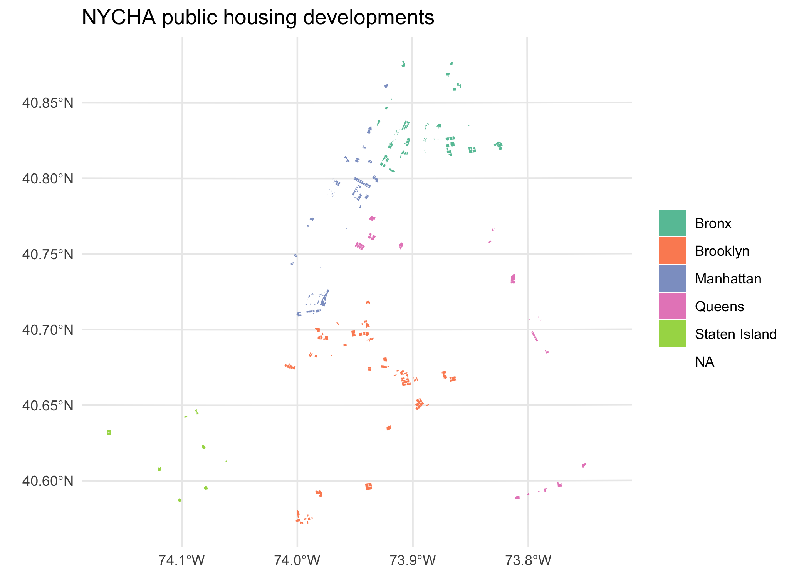

<!-- README.md is generated from README.Rmd. Please edit that file -->

# nycha 

<!-- badges: start -->

<!-- badges: end -->

Spatial and tabular data about the New York City Housing Authority
(NYCHA), including public housing development boundaries, residential
addresses, the NYCHA Development Data Book, housing maintenance code
violations on NYCHA properties, community facilities, service centers,
and aggregate resident statistics.

## Installation

``` r
remotes::install_github("kjhealy/nycha")
```

## Load

``` r
library(nycha)
library(tidyverse)
library(sf)
```

## What’s included

``` r
nyc_developments_sf
#> Simple feature collection with 216 features and 3 fields
#> Geometry type: GEOMETRY
#> Dimension:     XY
#> Bounding box:  xmin: 938397.7 ymin: 147529.6 xmax: 1058790 ymax: 259222.5
#> Projected CRS: NAD83 / New York Long Island (ftUS)
#> First 10 features:
#>                    development tds_num   borough                       geometry
#> 1  1162-1176 WASHINGTON AVENUE     233     Bronx POLYGON ((1010003 241714.5,...
#> 2           1471 WATSON AVENUE     214     Bronx POLYGON ((1017168 240378.7,...
#> 3         154 WEST 84TH STREET     359 Manhattan POLYGON ((991146.1 225607.7...
#> 4            303 VERNON AVENUE     156  Brooklyn POLYGON ((1001291 192938.1,...
#> 5              45 ALLEN STREET     265 Manhattan POLYGON ((986434.7 200501.3...
#> 6         830 AMSTERDAM AVENUE     150 Manhattan POLYGON ((992733.8 229669.5...
#> 7                        ADAMS     118     Bronx MULTIPOLYGON (((1010712 237...
#> 8                       ALBANY     031  Brooklyn POLYGON ((1001913 184970.7,...
#> 9                    ALBANY II     085  Brooklyn POLYGON ((1001913 184970.7,...
#> 10                   AMSTERDAM     022 Manhattan POLYGON ((987777.1 221132.5...
nyc_addresses_df
#> # A tibble: 2,955 × 26
#>    development       tds_num building_num stairhall_num borough house_num street
#>    <chr>               <dbl> <chr>        <chr>         <chr>   <chr>     <chr> 
#>  1 1162-1176 WASHIN…     233 1            003           Bronx   1162      WASHI…
#>  2 1471 WATSON AVEN…     214 1            029           Bronx   1471      WATSO…
#>  3 154 WEST 84TH ST…     359 1            047           Manhat… 154       WEST …
#>  4 303 VERNON AVENUE     156 1            025           Brookl… 303       VERNO…
#>  5 45 ALLEN STREET       265 1            003           Manhat… 45        ALLEN…
#>  6 830 AMSTERDAM AV…     150 1            029           Manhat… 830       AMSTE…
#>  7 ADAMS                 118 1            001           Bronx   745       EAST …
#>  8 ADAMS                 118 2            002           Bronx   700       WESTC…
#>  9 ADAMS                 118 3            003           Bronx   720       WESTC…
#> 10 ADAMS                 118 4            004           Bronx   721       TINTO…
#> # ℹ 2,945 more rows
#> # ℹ 19 more variables: address <chr>, city <chr>, state <chr>, zip_code <chr>,
#> #   bin <chr>, block <chr>, lot <chr>, bbl <chr>, census_tract_2020 <chr>,
#> #   nta_code <chr>, nta_name <chr>, community_district <dbl>,
#> #   city_council_district <dbl>, state_assembly_district <dbl>,
#> #   state_senate_district <dbl>, us_congressional_district <dbl>,
#> #   privately_managed <lgl>, latitude <dbl>, longitude <dbl>
nyc_violations_df
#> # A tibble: 3,475 × 35
#>    violation_id primary_bin primary_boro_id primary_borough_name
#>           <dbl>       <dbl>           <dbl> <chr>               
#>  1     18220152      808768               3 Brooklyn            
#>  2     18220153      808768               3 Brooklyn            
#>  3     18220154      808768               3 Brooklyn            
#>  4     18223815      286990               3 Brooklyn            
#>  5     18223816      286990               3 Brooklyn            
#>  6     18223817      286990               3 Brooklyn            
#>  7     18223818      286990               3 Brooklyn            
#>  8     18223819      286990               3 Brooklyn            
#>  9     18223820      286990               3 Brooklyn            
#> 10     18223821      286990               3 Brooklyn            
#> # ℹ 3,465 more rows
#> # ℹ 31 more variables: primary_house_number <chr>,
#> #   primary_low_house_number <chr>, primary_high_house_number <chr>,
#> #   primary_street_name <chr>, primary_postcode <chr>, development_name <chr>,
#> #   tds_number <dbl>, stairhall_number <dbl>,
#> #   nycha_address_section_boro_id <dbl>, nycha_address_section_borough <chr>,
#> #   nycha_address_section_house_number <chr>, …
nyc_community_facilities_df
#> # A tibble: 441 × 16
#>    funding_agency borough program_type        status development address sponsor
#>    <chr>          <chr>   <chr>               <chr>  <chr>       <chr>   <chr>  
#>  1 DYCD           Bronx   Community Center -… Occup… Sotomayor … 1000 R… Phipps…
#>  2 <NA>           Bronx   <NA>                Vacant Forest      1005 T… Vacant 
#>  3 <NA>           Bronx   <NA>                Vacant College Av… 1020 C… Vacant 
#>  4 OTHER          Bronx   Community Center    Occup… 1010 East … 1030 E… Phipps…
#>  5 <NA>           Bronx   <NA>                Vacant Boynton Av… 1057 B… Vacant 
#>  6 <NA>           Bronx   <NA>                Vacant Claremont … 1105 T… Vacant 
#>  7 AGING          Bronx   Senior Center       Occup… Highbridge… 1145 U… Presby…
#>  8 DYCD           Bronx   Community Center -… Occup… Highbridge… 1155 U… Cathol…
#>  9 <NA>           Bronx   <NA>                Vacant 1162 - 117… 1162 W… Vacant 
#> 10 Unknown        Bronx   Unknown             Occup… Davidson    1221 P… SOBRO …
#> # ℹ 431 more rows
#> # ℹ 9 more variables: postcode <chr>, latitude <dbl>, longitude <dbl>,
#> #   community_board <chr>, council_district <chr>, census_tract <chr>,
#> #   bin <chr>, bbl <chr>, nta <chr>
nyc_facilities_df
#> # A tibble: 536 × 15
#>    borough       development_name address status sponsor postcode type  latitude
#>    <chr>         <chr>            <chr>   <chr>  <chr>   <chr>    <chr>    <dbl>
#>  1 Manhattan     Baruch           595- 6… Occup… Henry … <NA>     Othe…       NA
#>  2 Staten Island Berry Houses     44 Don… Occup… Staten… 10306    Chil…       NA
#>  3 Brooklyn      Farragut         228 Yo… Occup… Spanis… <NA>     Seni…       NA
#>  4 Manhattan     Harborview Terr… 536 We… Occup… NYCHA   10019    Perf…       NA
#>  5 Brooklyn      Howard           1620 E… NYCHA… NYCHA   11212    Vaca…       NA
#>  6 Manhattan     Lexington        115 Ea… Occup… Lexing… 10029    Chil…       NA
#>  7 Brooklyn      Marcus Garvey    1440 E… Occup… Fort G… 11212    Seni…       NA
#>  8 Bronx         Monroe           1802 S… Vacant NYCHA   <NA>     Vaca…       NA
#>  9 Bronx         Pelham Parkway   975 Wa… Occup… Jewish… <NA>     Seni…       NA
#> 10 Brooklyn      Pink             2702 L… Occup… United… <NA>     Othe…       NA
#> # ℹ 526 more rows
#> # ℹ 7 more variables: longitude <dbl>, community_board <chr>,
#> #   community_council <dbl>, census_tract <chr>, bin <chr>, bbl <chr>,
#> #   nta <chr>
nyc_development_data_df
#> # A tibble: 346 × 52
#>    data_as_of development       hud_amp_number tds_number consolidated_tds_num…¹
#>    <date>     <chr>             <chr>          <chr>      <chr>                 
#>  1 2025-01-01 1010 EAST 178TH … NY005011330    180        180                   
#>  2 2025-01-01 104-14 TAPSCOTT … NY005011670    242        167                   
#>  3 2025-01-01 1162-1176 WASHIN… NY005013080    233        308                   
#>  4 2025-01-01 131 SAINT NICHOL… NY005010970    154        097                   
#>  5 2025-01-01 1471 WATSON AVEN… NY005010670    214        067                   
#>  6 2025-01-01 154 WEST 84TH ST… NY005013590    359        359                   
#>  7 2025-01-01 303 VERNON AVENUE NY005010730    156        073                   
#>  8 2025-01-01 335 EAST 111TH S… NY005010640    203        064                   
#>  9 2025-01-01 344 EAST 28TH ST… NY005021850    185        153                   
#> 10 2025-01-01 45 ALLEN STREET   NY005011000    265        100                   
#> # ℹ 336 more rows
#> # ℹ abbreviated name: ¹​consolidated_tds_number
#> # ℹ 47 more variables: development_edp_number <chr>,
#> #   operating_edp_number <chr>, hud_number <chr>, program <chr>, method <chr>,
#> #   type <chr>, number_of_section_8_transition_apartments <dbl>,
#> #   number_of_current_apartments <dbl>, total_number_of_apartments <dbl>,
#> #   number_of_rental_rooms <dbl>, avg_no_r_r_per_apartment <dbl>, …
nyc_resident_summary_df
#> # A tibble: 26 × 43
#>    program          statecity_section8_f…¹ total_families total_female_headed_…²
#>    <chr>            <chr>                           <dbl>                  <dbl>
#>  1 FEDERAL          TOTAL HOUSEHOLDS               131286                 101586
#>  2 FORMER NEW YORK… TOTAL HOUSEHOLDS                 7668                   5754
#>  3 FORMER NEW YORK… PUBLIC HOUSING HOUSEH…           6319                   4730
#>  4 FORMER NEW YORK… SECTION 8 TRANSITION …           1349                   1024
#>  5 FORMER NEW YORK… TOTAL HOUSEHOLDS                 4020                   3224
#>  6 FORMER NEW YORK… PUBLIC HOUSING HOUSEH…           3305                   2653
#>  7 FORMER NEW YORK… SECTION 8 TRANSITION …            715                    571
#>  8 MIXED FINANCE (… TOTAL HOUSEHOLDS                11688                   8978
#>  9 MIXED FINANCE (… PUBLIC HOUSING HOUSEH…           9624                   7383
#> 10 MIXED FINANCE (… SECTION 8 TRANSITION …           2064                   1595
#> # ℹ 16 more rows
#> # ℹ abbreviated names: ¹​statecity_section8_flag, ²​total_female_headed_families
#> # ℹ 39 more variables: total_male_headed_families <dbl>,
#> #   total_population <dbl>, average_family_size <dbl>,
#> #   total_minors_under_18 <dbl>, average_minors_per_family <dbl>,
#> #   total_minors_as_percent_of_population <dbl>,
#> #   all_average_total_gross_income <dbl>, all_average_gross_rent <dbl>, …
```

## Example: total apartments and population by borough

``` r
nyc_development_data_df |>
  summarise(
    developments = n(),
    apartments = sum(total_number_of_apartments, na.rm = TRUE),
    population = sum(total_population, na.rm = TRUE),
    .by = borough
  ) |>
  arrange(desc(apartments))
#> # A tibble: 7 × 4
#>   borough         developments apartments population
#>   <chr>                  <int>      <dbl>      <dbl>
#> 1 Brooklyn                 104      61731     122830
#> 2 Manhattan                105      55519     104053
#> 3 Bronx                     95      44489      90991
#> 4 Queens                    27      16802      33167
#> 5 Staten Island             10       4510       8633
#> 6 Brooklyn/Queens            2         59         73
#> 7 Bronx/Queens               3         31         47
```

## Example: map of NYCHA developments

``` r
ggplot(nyc_developments_sf) +
  geom_sf(aes(fill = borough), colour = NA) +
  scale_fill_brewer(palette = "Set2") +
  labs(
    title = "NYCHA public housing developments",
    fill = NULL
  ) +
  theme_minimal()
```


